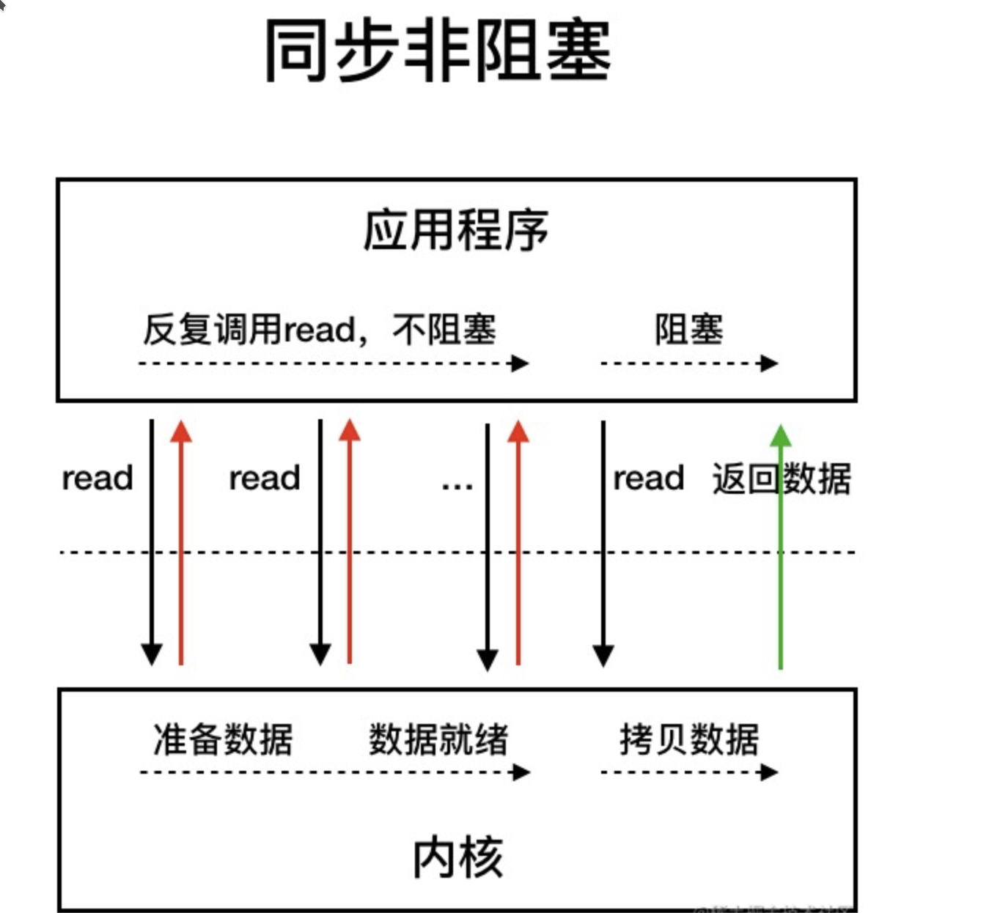

### IO流

#### 简介

IO 即 `Input/Output`，输入和输出。数据输入到计算机内存的过程即输入，反之输出到外部存储（比如数据库，文件）的过程即输出。IO 流在 Java 中分为输入流和输出流，而根据数据的处理方式又分为字节流和字符流。

Java IO 流的 40 多个类都是从如下 4 个抽象类基类中派生出来的。

- `InputStream`/`Reader`: 所有的输入流的基类，前者是字节输入流，后者是字符输入流。
- `OutputStream`/`Writer`: 所有输出流的基类，前者是字节输出流，后者是字符输出流。

#### 字节流

`FIleInputStream`

```java
try (InputStream fis = new FileInputStream("input.txt")) {
    System.out.println("Number of remaining bytes:" + fis.available());
    int content;
    long skip = fis.skip(2);
    System.out.println("The actual number of bytes skipped:" + skip);
    System.out.print("The content read from file:");
    while ((content = fis.read()) != -1) {
        System.out.print((char) content);
    }
} catch (IOException e) {
    e.printStackTrace();
}
```

一般使用`BufferedInputStream`(字节缓冲输入流)

```java
// 新建一个 BufferedInputStream 对象
BufferedInputStream bufferedInputStream = new BufferedInputStream(new FileInputStream("input.txt"));
// 读取文件的内容并复制到 String 对象中，jdk9的写法
String result = new String(bufferedInputStream.readAllBytes());
System.out.println(result);
```

`FileOutputStream`

```java
try (FileOutputStream output = new FileOutputStream("output.txt")) {
    byte[] array = "Java".getBytes();
    output.write(array);
} catch (IOException e) {
    e.printStackTrace();
}
```

#### 字符流

字符流默认采用的是 `Unicode` 编码，我们可以通过构造方法自定义编码。

常用字符编码所占字节数：`utf8` :英文占 1 字节，中文占 3 字节，`unicode`：任何字符都占 2 个字节，`gbk`：英文占 1 字节，中文占 2 字节。

`Reader`

```java
// 字节流转换为字符流的桥梁
public class InputStreamReader extends Reader {
}
// 用于读取字符文件
public class FileReader extends InputStreamReader {
}
```

```java
try (FileReader fileReader = new FileReader("input.txt");) {
    int content;
    long skip = fileReader.skip(3);
    System.out.println("The actual number of bytes skipped:" + skip);
    System.out.print("The content read from file:");
    while ((content = fileReader.read()) != -1) {
        System.out.print((char) content);
    }
} catch (IOException e) {
    e.printStackTrace();
}
```

`Write`

```java
// 字符流转换为字节流的桥梁
public class OutputStreamWriter extends Writer {
}
// 用于写入字符到文件
public class FileWriter extends OutputStreamWriter {
}
```

```java
try (Writer output = new FileWriter("output.txt")) {
    output.write("你好，我是Guide。");
} catch (IOException e) {
    e.printStackTrace();
}
```

### IO流设计模式

#### 装饰器模式

**装饰器（Decorator）模式** 可以在不改变原有对象的情况下拓展其功能。通过**组合**替代继承来扩展原始类的功能，在一些**继承关系比较复杂**的场景更加实用。

对于字节流来说， `FilterInputStream` （对应输入流）和`FilterOutputStream`（对应输出流）是装饰器模式的核心，分别用于增强 `InputStream` 和`OutputStream`子类对象的功能。

常见的`BufferedInputStream`(字节缓冲输入流)、`DataInputStream` 等等都是`FilterInputStream` 的子类，`BufferedOutputStream`（字节缓冲输出流）、`DataOutputStream`等等都是`FilterOutputStream`的子类。

举个例子，我们可以通过 `BufferedInputStream`（字节缓冲输入流）来增强 `FileInputStream` 的功能。

```java
// BufferedInputStream 构造函数其中的一个参数就是 InputStream
public BufferedInputStream(InputStream in) {
    this(in, DEFAULT_BUFFER_SIZE);
}

public BufferedInputStream(InputStream in, int size) {
    super(in);
    if (size <= 0) {
        throw new IllegalArgumentException("Buffer size <= 0");
    }
    buf = new byte[size];
}
```

```java
// BufferedInputStream`代码示例：
try (BufferedInputStream bis = new BufferedInputStream(new FileInputStream("input.txt"))) {
    int content;
    long skip = bis.skip(2);
    while ((content = bis.read()) != -1) {
        System.out.print((char) content);
    }
} catch (IOException e) {
    e.printStackTrace();
}
```

另外`ZipInputStream` 和`ZipOutputStream` 还可以分别增强 `BufferedInputStream` 和 `BufferedOutputStream` 的能力

```java
BufferedInputStream bis = new BufferedInputStream(new FileInputStream(fileName));
ZipInputStream zis = new ZipInputStream(bis);

BufferedOutputStream bos = new BufferedOutputStream(new FileOutputStream(fileName));
ZipOutputStream zipOut = new ZipOutputStream(bos);
```

`ZipInputStream` 和`ZipOutputStream` 分别继承自`InflaterInputStream` 和`DeflaterOutputStream`

```java
public
class InflaterInputStream extends FilterInputStream {
}

public
class DeflaterOutputStream extends FilterOutputStream {
}
```

可以对原始类嵌套使用**多个装饰器**是装饰器模式很重要的一个特征，为了实现这一效果，装饰器类需要跟原始类**继承相同的抽象类或者实现相同的接口**。上面介绍到的这些 IO 相关的装饰类和原始类共同的父类是 `InputStream` 和`OutputStream`。


#### 适配器模式

**适配器（Adapter Pattern）模式** 主要用于接口互不兼容的类的协调工作。

适配器模式中存在被适配的对象或者类称为 **适配者(`Adaptee`)** ，作用于适配者的对象或者类称为**适配器(`Adapter`)** 。适配器分为对象适配器和类适配器。**类适配器使用继承关系来实现，对象适配器使用组合关系来实现**。

IO 流中的字符流和字节流的接口不同，它们之间可以协调工作就是基于适配器模式来做的。通过适配器，我们可以将字节流对象适配成一个字符流对象，这样我们可以直接通过字节流对象来读取或者写入字符数据。

`InputStreamReader` 和 `OutputStreamWriter` 就是两个适配器(Adapter)， 同时，它们两个也是字节流和字符流之间的桥梁。`InputStreamReader` 使用 `StreamDecoder` （流解码器）对字节进行解码，实现字节流到字符流的转换，

 `OutputStreamWriter` 使用`StreamEncoder`（流编码器）对字符进行编码，实现字符流到字节流的转换。

`InputStream` 和 `OutputStream` 的子类是被适配者， `InputStreamReader` 和 `OutputStreamWriter`是适配器

```java
// InputStreamReader 是适配器，FileInputStream 是被适配的类
InputStreamReader isr = new InputStreamReader(new FileInputStream(fileName), "UTF-8");
// BufferedReader 增强 InputStreamReader 的功能（装饰器模式）
BufferedReader bufferedReader = new BufferedReader(isr);
```

`java.io.InputStreamReader` 部分源码：

```java
public class InputStreamReader extends Reader {
	//用于解码的对象
	private final StreamDecoder sd;
    public InputStreamReader(InputStream in) {
        super(in);
        try {
            // 获取 StreamDecoder 对象
            sd = StreamDecoder.forInputStreamReader(in, this, (String)null);
        } catch (UnsupportedEncodingException e) {
            throw new Error(e);
        }
    }
    // 使用 StreamDecoder 对象做具体的读取工作
	public int read() throws IOException {
        return sd.read();
    }
}
```

`java.io.OutputStreamWriter` 部分源码：

```java
public class OutputStreamWriter extends Writer {
    // 用于编码的对象
    private final StreamEncoder se;
    public OutputStreamWriter(OutputStream out) {
        super(out);
        try {
           // 获取 StreamEncoder 对象
            se = StreamEncoder.forOutputStreamWriter(out, this, (String)null);
        } catch (UnsupportedEncodingException e) {
            throw new Error(e);
        }
    }
    // 使用 StreamEncoder 对象做具体的写入工作
    public void write(int c) throws IOException {
        se.write(c);
    }
}
```


**适配器模式和装饰器模式有什么区别呢**

**装饰器模式** 更侧重于动态地增强原始类的功能，装饰器类需要跟原始类继承相同的抽象类或者实现相同的接口。并且，装饰器模式支持对原始类嵌套使用多个装饰器。

**适配器模式** 更侧重于让接口不兼容而不能交互的类可以一起工作，当我们调用适配器对应的方法时，适配器内部会调用适配者类或者和适配类相关的类的方法，这个过程透明的。就比如说 `StreamDecoder` （流解码器）和`StreamEncoder`（流编码器）就是分别基于 `InputStream` 和 `OutputStream` 来获取 `FileChannel`对象并调用对应的 `read` 方法和 `write` 方法进行字节数据的读取和写入

```java
StreamDecoder(InputStream in, Object lock, CharsetDecoder dec) {
    // 省略大部分代码
    // 根据 InputStream 对象获取 FileChannel 对象
    ch = getChannel((FileInputStream)in);
}
```

适配器和适配者两者不需要继承相同的抽象类或者实现相同的接口。

另外，`FutureTask` 类使用了适配器模式，`Executors` 的内部类 `RunnableAdapter` 实现属于适配器，用于将 `Runnable` 适配成 `Callable`。

`FutureTask`参数包含 `Runnable` 的一个构造方法

```java
public FutureTask(Runnable runnable, V result) {
    // 调用 Executors 类的 callable 方法
    this.callable = Executors.callable(runnable, result);
    this.state = NEW;
}
```

`Executors`中对应的方法和适配器：

```java
// 实际调用的是 Executors 的内部类 RunnableAdapter 的构造方法
public static <T> Callable<T> callable(Runnable task, T result) {
    if (task == null)
        throw new NullPointerException();
    return new RunnableAdapter<T>(task, result);
}
// 适配器
static final class RunnableAdapter<T> implements Callable<T> {
    final Runnable task;
    final T result;
    RunnableAdapter(Runnable task, T result) {
        this.task = task;
        this.result = result;
    }
    public T call() {
        task.run();
        return result;
    }
}
```


#### 工厂模式

工厂模式用于创建对象，NIO 中大量用到了工厂模式，比如 `Files` 类的 `newInputStream` 方法用于创建 `InputStream` 对象（静态工厂）、 `Paths` 类的 `get` 方法创建 `Path` 对象（静态工厂）、`ZipFileSystem` 类（`sun.nio`包下的类，属于 `java.nio` 相关的一些内部实现）的 `getPath` 的方法创建 `Path` 对象（简单工厂）

```java
InputStream is = Files.newInputStream(Paths.get(path))
```


#### 观察者模式

NIO 中的文件目录监听服务使用到了观察者模式。

NIO 中的文件目录监听服务基于 `WatchService` 接口和 `Watchable` 接口。`WatchService` 属于观察者，`Watchable` 属于被观察者。

`Watchable` 接口定义了一个用于将对象注册到 `WatchService`（监控服务） 并绑定监听事件的方法 `register`

```java
public interface Path
    extends Comparable<Path>, Iterable<Path>, Watchable{
}

public interface Watchable {
    WatchKey register(WatchService watcher,
                      WatchEvent.Kind<?>[] events,
                      WatchEvent.Modifier... modifiers)
        throws IOException;
}
```

`WatchService` 用于监听文件目录的变化，同一个 `WatchService` 对象能够监听多个文件目录

```java
// 创建 WatchService 对象
WatchService watchService = FileSystems.getDefault().newWatchService();
// 初始化一个被监控文件夹的 Path 类:
Path path = Paths.get("workingDirectory");
// 将这个 path 对象注册到 WatchService（监控服务） 中去
WatchKey watchKey = path.register(watchService, StandardWatchEventKinds...);
```

`Path` 类 `register` 方法的第二个参数 `events` （需要监听的事件）为可变长参数，也就是说我们可以同时监听多种事件

```java
WatchKey register(WatchService watcher, WatchEvent.Kind<?>... events) throws IOException;
```

常用的监听事件有 3 种：

- `StandardWatchEventKinds.ENTRY_CREATE` ：文件创建。
- `StandardWatchEventKinds.ENTRY_DELETE` : 文件删除。
- `StandardWatchEventKinds.ENTRY_MODIFY` : 文件修改。

`register` 方法返回 `WatchKey` 对象，通过`WatchKey` 对象可以获取事件的具体信息比如文件目录下是创建、删除还是修改了文件、创建、删除或者修改的文件的具体名称是什么

```java
WatchKey key;
while ((key = watchService.take()) != null) {
    for (WatchEvent<?> event : key.pollEvents()) {
      // 可以调用 WatchEvent 对象的方法做一些事情比如输出事件的具体上下文信息
    }
    key.reset();
}
```

`WatchService` 内部是通过一个 daemon thread（守护线程）采用定期轮询的方式来检测文件的变化，简化后的源码如下所示

```java
class PollingWatchService extends AbstractWatchService {
    // 定义一个 daemon thread（守护线程）轮询检测文件变化
    private final ScheduledExecutorService scheduledExecutor;

    PollingWatchService() {
        scheduledExecutor = Executors
            .newSingleThreadScheduledExecutor(new ThreadFactory() {
                 @Override
                 public Thread newThread(Runnable r) {
                     Thread t = new Thread(r);
                     t.setDaemon(true);
                     return t;
                 }});
    }

    void enable(Set<? extends WatchEvent.Kind<?>> events, long period) {
        synchronized (this) {
          // 更新监听事件
          this.events = events;

            // 开启定期轮询
          Runnable thunk = new Runnable() { public void run() { poll(); }};
          this.poller = scheduledExecutor
            .scheduleAtFixedRate(thunk, period, period, TimeUnit.SECONDS);
        }
    }
}
```


### JAVA IO模型

**从计算机结构的视角解读一下I/O**

根据冯.诺依曼结构，计算机结构分为 5 大部分：运算器、控制器、存储器、输入设备、输出设备

输入设备（比如键盘）和输出设备（比如显示器）都属于外部设备。网卡、硬盘这种既可以属于输入设备，也可以属于输出设备。

输入设备向计算机输入数据，输出设备接收计算机输出的数据，**I/O 描述了计算机系统与外部设备之间通信的过程**


**从应用程序的角度解读一下 I/O**

为了保证操作系统的稳定性和安全性，一个进程的地址空间划分为 **用户空间（User space）** 和 **内核空间（Kernel space ）**

我们平常运行的应用程序都是运行在用户空间，只有内核空间才能进行**系统态级别**的资源有关的操作，比如文件管理、进程通信、内存管理等。也就是说，我们想要进行 IO 操作，一定是要依赖内核空间的能力。

用户空间的程序不能直接访问内核空间。当想要执行 IO 操作时，由于没有执行这些操作的权限，只能**发起系统调用**请求操作系统帮忙完成。因此，用户进程想要执行 IO 操作的话，必须通过 **系统调用** 来间接访问内核空间。

我们在平常开发过程中接触最多的就是 **磁盘 IO（读写文件）** 和 **网络 IO（网络请求和响应）**。

**从应用程序的视角来看的话，我们的应用程序实际上只是发起了 IO 操作的调用而已，具体 IO 的执行是由操作系统的内核来完成的。**

当应用程序发起 I/O 调用后，会经历两个步骤：

1. 内核等待 I/O 设备准备好数据
2. 内核将数据从内核空间拷贝到用户空间。

#### 常见的IO模型

UNIX 系统下， IO 模型一共有 5 种： **同步阻塞 I/O**、**同步非阻塞 I/O**、**I/O 多路复用**、**信号驱动 I/O** 和**异步 I/O**

#### JAVA中3种IO模型

#### `BIO`

**`BIO` 属于同步阻塞 IO 模型** 。

同步阻塞 IO 模型中，应用程序发起 read 调用后，会一直阻塞，直到内核把数据拷贝到用户空间


在客户端连接数量不高的情况下，是没问题的。但是，当面对十万甚至百万级连接的时候，传统的 `BIO` 模型是无能为力的。因此，我们需要一种更高效的 I/O 处理模型来应对更高的并发量

#### `NIO` (Non-blocking I/O)

Java 中的 `NIO` 于 Java 1.4 引入，它是支持面向缓冲的，基于通道的 I/O 操作方法。 对于高负载、高并发的场景应使用 `NIO` 。

Java 中的 `NIO` 可以看作是 **I/O 多路复用模型**。也有很多人认为，Java 中的 `NIO `属于同步非阻塞 IO 模型。

 **同步非阻塞 IO 模型**



同步非阻塞 IO 模型中，**应用程序会一直发起 read 调用，等待数据从内核空间拷贝到用户空间的这段时间里，线程依然是阻塞的，直到在内核把数据拷贝到用户空间**。

相比于同步阻塞 IO 模型，同步非阻塞 IO 模型确实有了很大改进。**通过轮询操作，避免了一直阻塞**。但是，**应用程序不断进行 I/O 系统调用轮询数据是否已经准备好的过程是十分消耗 CPU 资源的。**

这个时候，**I/O 多路复用模型** 就上场了


IO 多路复用模型中，线程首先发起 select 调用，询问内核数据是否准备就绪，等内核把数据准备好了，用户线程再发起 read 调用。read 调用的过程（数据从内核空间 -> 用户空间）还是阻塞的。

> 目前支持 IO 多路复用的系统调用，有 select，epoll 等等。select 系统调用，目前几乎在所有的操作系统上都有支持。
>
> - **select 调用** ：内核提供的系统调用，它支持一次查询多个系统调用的可用状态。几乎所有的操作系统都支持。
> - **epoll 调用** ：linux 2.6 内核，属于 select 调用的增强版本，优化了 IO 的执行效率。

**IO 多路复用模型，通过减少无效的系统调用，减少了对 CPU 资源的消耗。**

Java 中的 NIO ，有一个非常重要的**选择器 ( Selector )** 的概念，也可以被称为 **多路复用器**。通过它，只需要一个线程便可以管理多个客户端连接。当客户端数据到了之后，才会为其服务。


#### AIO (Asynchronous I/O)

AIO 也就是 NIO 2。Java 7 中引入了 NIO 的改进版 NIO 2，它是异步 IO 模型。

异步 IO 是基于事件和回调机制实现的，也就是应用操作之后会直接返回，不会堵塞在那里，当后台处理完成，操作系统会通知相应的线程进行后续的操作


目前来说 AIO 的应用还不是很广泛。Netty 之前也尝试使用过 AIO，不过又放弃了。这是因为Netty 使用了 AIO 之后，在 Linux 系统上的性能并没有多少提升。

#### 简单总结一下 Java 中的 BIO、NIO、AIO


