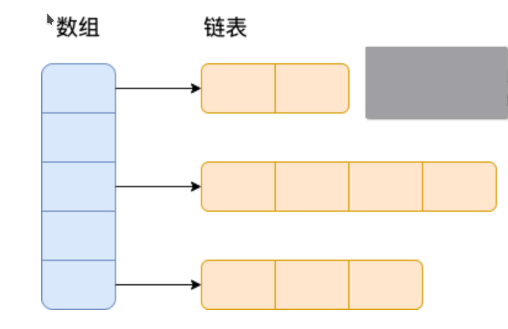
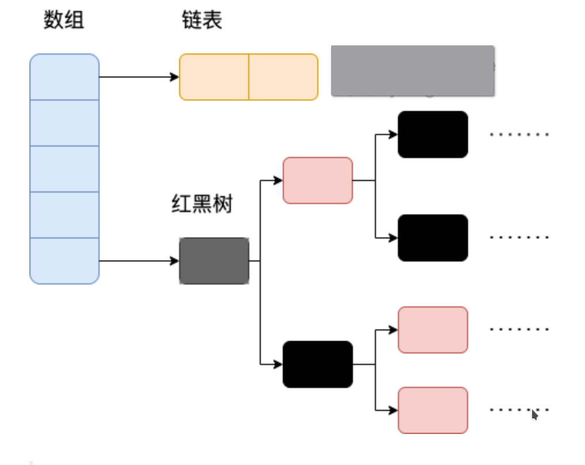
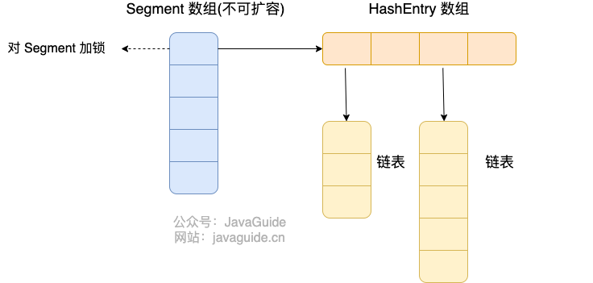

### 集合

Java 集合， 也叫作容器，主要是由两大接口派生而来：一个是 `Collection`接口，主要用于存放单一元素；另一个是 `Map` 接口，主要用于存放键值对。对于`Collection` 接口，下面又有三个主要的子接口：`List`、`Set` 和 `Queue`。


#### List、Set、Quene、Map的区别

- `List`(对付顺序的好帮手): 存储的元素是有序的、可重复的。
- `Set`(注重独一无二的性质): 存储的元素是无序的、不可重复的。
- `Queue`(实现排队功能的叫号机): 按特定的排队规则来确定先后顺序，存储的元素是有序的、可重复的。
- `Map`(用 key 来搜索的专家): 使用键值对（key-value）存储，key 是无序的、不可重复的，value 是无序的、可重复的，每个键最多映射到一个值。

#### 集合框架底层数据结构总结

`Collection` 接口下面的集合。

#### List

- `ArrayList`： `Object[]` 数组，插入和删除元素的时间复杂度受元素位置的影响，适用于频繁的查找操作(实现RandomAccess接口)，线程不安全

  ```
  关于RandomAccess接口，里边没有任何定义，是一个标识，标识实现这个接口的类具有随机访问功能
  ```

  

- `Vector`：`Object[]` 数组，线程安全

- `LinkedList`： 双向链表(JDK1.6 之前为循环链表，JDK1.7 取消了循环)，线程不安全

#### Set

- `HashSet`(无序，唯一): 基于 `HashMap` 实现的，底层采用 `HashMap` 来保存元素
- `LinkedHashSet`: `LinkedHashSet` 是 `HashSet` 的子类，并且其内部是通过 `LinkedHashMap` 来实现的
- `TreeSet`(有序，唯一): 红黑树(自平衡的排序二叉树)

#### Queue

- `PriorityQueue`: `Object[]` 数组来实现二叉堆
- `ArrayQueue`: `Object[]` 数组 + 双指针

`Map` 接口下面的集合。

#### Map

- `HashMap`： JDK1.8 之前 `HashMap` 由数组+链表组成的，数组是 `HashMap` 的主体，链表则是主要为了解决哈希冲突而存在的（**拉链法**解决冲突）。JDK1.8 以后在解决哈希冲突时有了较大的变化，当链表长度大于阈值（默认为 8）（将链表转换成红黑树前会判断，如果当前数组的长度小于 64，那么会选择先进行数组扩容，而不是转换为红黑树）时，将链表转化为红黑树，以减少搜索时间
- `LinkedHashMap`： `LinkedHashMap` 继承自 `HashMap`，所以它的底层仍然是基于拉链式散列结构即由数组和链表或红黑树组成。另外，`LinkedHashMap` 在上面结构的基础上，增加了一条双向链表，使得上面的结构可以保持键值对的插入顺序。同时通过对链表进行相应的操作，实现了访问顺序相关逻辑。
- `Hashtable`： 数组+链表组成的，数组是 `Hashtable` 的主体，链表则是主要为了解决哈希冲突而存在的
- `TreeMap`： 红黑树（自平衡的排序二叉树）

#### ArrayList的扩容机制


#### 无序性和不可重复性的含义是什么

- 无序性不等于随机性 ，无序性是指存储的数据在底层数组中并非按照数组索引的顺序添加 ，而是根据数据的哈希值决定的。
- 不可重复性是指添加的元素按照 `equals()` 判断时 ，返回 false，需要同时重写 `equals()` 方法和 `hashCode()` 方法。

#### 比较 HashSet、LinkedHashSet 和 TreeSet 三者的异同

- `HashSet`、`LinkedHashSet` 和 `TreeSet` 都是 `Set` 接口的实现类，都能保证元素唯一，并且都是线程不安全的。

- `HashSet`、`LinkedHashSet` 和 `TreeSet` 的主要区别在于底层数据结构不同。

  `HashSet` 的底层数据结构是哈希表（基于 `HashMap` 实现）。

  `LinkedHashSet` 的底层数据结构是链表和哈希表，元素的插入和取出顺序满足**先进先出**(FIFO)。

  `TreeSet` 底层数据结构是红黑树，元素是有序的，排序的方式有自然排序和定制排序。

- 底层数据结构不同又导致这三者的应用场景不同。`HashSet` 用于不需要保证元素插入和取出顺序的场景，`LinkedHashSet` 用于保证元素的插入和取出顺序满足 FIFO 的场景，`TreeSet` 用于支持对元素自定义排序规则的场景。

### Collection子接口Quene

#### Queue 与 Deque 的区别

`Queue` 是单端队列，只能从一端插入元素，另一端删除元素，实现上一般遵循 **先进先出（FIFO）** 规则。

`Queue` 扩展了 `Collection` 的接口，根据 **因为容量问题而导致操作失败后处理方式的不同** 可以分为两类方法: 一种在操作失败后会抛出异常，另一种则会返回特殊值。

| `Queue` 接口 | 抛出异常  | 返回特殊值 |
| ------------ | --------- | ---------- |
| 插入队尾     | add(E e)  | offer(E e) |
| 删除队首     | remove()  | poll()     |
| 查询队首元素 | element() | peek()     |

`Deque` 是双端队列，在队列的两端均可以插入或删除元素。

`Deque` 扩展了 `Queue` 的接口, 增加了在队首和队尾进行插入和删除的方法，同样根据失败后处理方式的不同分为两类：

| `Deque` 接口 | 抛出异常      | 返回特殊值      |
| ------------ | ------------- | --------------- |
| 插入队首     | addFirst(E e) | offerFirst(E e) |
| 插入队尾     | addLast(E e)  | offerLast(E e)  |
| 删除队首     | removeFirst() | pollFirst()     |
| 删除队尾     | removeLast()  | pollLast()      |
| 查询队首元素 | getFirst()    | peekFirst()     |
| 查询队尾元素 | getLast()     | peekLast()      |

事实上，`Deque` 还提供有 `push()` 和 `pop()` 等其他方法，可用于模拟栈。

#### ArrayDeque 与 LinkedList 的区别

`ArrayDeque` 和 `LinkedList` 都实现了 `Deque` 接口，两者都具有队列的功能，但两者有什么区别呢？

- `ArrayDeque` 是基于可变长的数组和双指针来实现，而 `LinkedList` 则通过链表来实现。
- `ArrayDeque` 不支持存储 `NULL` 数据，但 `LinkedList` 支持。
- `ArrayDeque` 是在 JDK1.6 才被引入的，而`LinkedList` 早在 JDK1.2 时就已经存在。
- `ArrayDeque` 插入时可能存在扩容过程, 不过均摊后的插入操作依然为 O(1)。虽然 `LinkedList` 不需要扩容，但是每次插入数据时均需要申请新的堆空间，均摊性能相比更慢。

从性能的角度上，选用 `ArrayDeque` 来实现队列要比 `LinkedList` 更好。此外，`ArrayDeque` 也可以用于实现栈。

#### 说一说 PriorityQueue

`PriorityQueue` 是在 JDK1.5 中被引入的, 其与 `Queue` 的区别在于元素出队顺序是与优先级相关的，即总是优先级最高的元素先出队。

这里列举其相关的一些要点：

- `PriorityQueue` 利用了二叉堆的数据结构来实现的，底层使用可变长的数组来存储数据
- `PriorityQueue` 通过堆元素的上浮和下沉，实现了在 O(logn) 的时间复杂度内插入元素和删除堆顶元素。
- `PriorityQueue` 是线程不安全的，且不支持存储 `NULL` 和 `non-comparable` 的对象。
- `PriorityQueue` 默认是小顶堆，但可以接收一个 `Comparator` 作为构造参数，从而来自定义元素优先级的先后。

`PriorityQueue` 相关算法典型例题包括堆排序、求第K大的数、带权图的遍历等。


### Map接口

#### HashMap 和 Hashtable 的区别

- **线程是否安全：** `HashMap` 是线程不安全的，`Hashtable` 是线程安全的,因为 `Hashtable` 内部的方法基本都经过`synchronized` 修饰。
- **效率：** 因为线程安全的问题，`HashMap` 要比 `Hashtable` 效率高一点。
- **对 Null key 和 Null value 的支持：** `HashMap` 可以存储 null 的 key 和 value，但 null 作为键只能有一个，null 作为值可以有多个；Hashtable 不允许有 null 键和 null 值，否则会抛出 `NullPointerException`。
- **初始容量大小和每次扩充容量大小的不同 ：** ① 创建时如果不指定容量初始值，`Hashtable` 默认的初始大小为 11，之后每次扩充，容量变为原来的 2n+1。`HashMap` 默认的初始化大小为 16。之后每次扩充，容量变为原来的 **2 倍**。② 创建时如果给定了容量初始值，那么 `Hashtable` 会直接使用你给定的大小，而 `HashMap` 会将其扩充为 **2 的幂次方**大小（`HashMap` 中的`tableSizeFor()`方法保证，下面给出了源代码）。也就是说 `HashMap` 总是使用 2 的幂作为哈希表的大小
- **底层数据结构：** JDK1.8 以后的 `HashMap` 在解决哈希冲突时有了较大的变化，当链表长度大于阈值（默认为 8）时，将链表转化为红黑树（将链表转换成红黑树前会判断，如果当前数组的长度小于 64，那么会选择先进行数组扩容，而不是转换为红黑树），以减少搜索时间。`Hashtable` 没有这样的机制。

**HashMap指定初始容量的构造函数**

```java
public HashMap(int initialCapacity, float loadFactor) {
    if (initialCapacity < 0)
        throw new IllegalArgumentException("Illegal initial capacity: " + initialCapacity);
    if (initialCapacity > MAXIMUM_CAPACITY)
        initialCapacity = MAXIMUM_CAPACITY;
    if (loadFactor <= 0 || Float.isNaN(loadFactor))
        throw new IllegalArgumentException("Illegal load factor: " + loadFactor);
    this.loadFactor = loadFactor;
    this.threshold = tableSizeFor(initialCapacity);
}
 public HashMap(int initialCapacity) {
    this(initialCapacity, DEFAULT_LOAD_FACTOR);
}
```

**tableSizeFor()保证了`HashMap`总是使用2的幂次方作为哈希表的大小**

```java
/**
 * Returns a power of two size for the given target capacity.
 */
static final int tableSizeFor(int cap) {
    int n = cap - 1;
    n |= n >>> 1;
    n |= n >>> 2;
    n |= n >>> 4;
    n |= n >>> 8;
    n |= n >>> 16;
    return (n < 0) ? 1 : (n >= MAXIMUM_CAPACITY) ? MAXIMUM_CAPACITY : n + 1;
}
```

#### HashMap 和 HashSet 区别

`HashSet` 底层就是基于 `HashMap` 实现的。（`HashSet` 的源码非常非常少，因为除了 `clone()`、`writeObject()`、`readObject()`是 `HashSet` 自己不得不实现之外，其他方法都是直接调用 `HashMap` 中的方法）

|               `HashMap`                |                          `HashSet`                           |
| :------------------------------------: | :----------------------------------------------------------: |
|           实现了 `Map` 接口            |                       实现 `Set` 接口                        |
|               存储键值对               |                          仅存储对象                          |
|     调用 `put()`向 map 中添加元素      |             调用 `add()`方法向 `Set` 中添加元素              |
| `HashMap` 使用键（Key）计算 `hashcode` | `HashSet` 使用成员对象来计算 `hashcode` 值，对于两个对象来说 `hashcode` 可能相同，所以`equals()`方法用来判断对象的相等性 |

#### HashMap 和 TreeMap 区别

`TreeMap` 和`HashMap` 都继承自`AbstractMap` ，但是需要注意的是`TreeMap`它还实现了`NavigableMap`接口和`SortedMap` 接口。

1. 实现 `NavigableMap` 接口让 `TreeMap` 有了对集合内元素的搜索的能力。
2. 实现`SortedMap`接口让 `TreeMap` 有了对集合中的元素根据键排序的能力。默认是按 key 的升序排序，不过我们也可以指定排序的比较器

#### HashMap的底层实现

JDK1.8 之前 `HashMap` 底层是 **数组和链表** 结合在一起使用也就是 **链表散列**。HashMap 通过 key 的 `hashcode` 经过**扰动函数**处理过后得到 hash 值，然后通过 `(n - 1) & hash` 判断当前元素存放的位置（这里的 n 指的是数组的长度），如果当前位置存在元素的话，就判断该元素与要存入的元素的 hash 值以及 key 是否相同，如果相同的话，直接覆盖，不相同就通过拉链法解决冲突。

所谓扰动函数指的就是 HashMap 的 `hash` 方法。使用扰动函数之后可以减少碰撞。

```java
static final int hash(Object key) {
  int h;
  // key.hashCode()：返回散列值也就是hashcode
  // ^ ：按位异或
  // >>>:无符号右移，忽略符号位，空位都以0补齐
  return (key == null) ? 0 : (h = key.hashCode()) ^ (h >>> 16);
}
```

所谓 **“拉链法”** 就是：将链表和数组相结合。也就是说创建一个链表数组，数组中每一格就是一个链表。若遇到哈希冲突，则将冲突的值加到链表中即可。



相比于之前的版本， JDK1.8 之后在解决哈希冲突时有了较大的变化，当链表长度大于阈值（默认为 8）（将链表转换成红黑树前会判断，如果当前数组的长度小于 64，那么会选择先进行数组扩容，而不是转换为红黑树）时，将链表转化为红黑树，以减少搜索时间



> TreeMap、TreeSet 以及 JDK1.8 之后的 HashMap 底层都用到了红黑树。红黑树就是为了解决二叉查找树的缺陷，因为二叉查找树在某些情况下会退化成一个线性结构。

结合源码分析一下 `HashMap` 链表到红黑树的转换。

**1、 `putVal` 方法中执行链表转红黑树的判断逻辑。**

链表的长度大于 8 的时候，就执行 `treeifyBin` （转换红黑树）的逻辑。

```java
// 遍历链表
for (int binCount = 0; ; ++binCount) {
    // 遍历到链表最后一个节点
    if ((e = p.next) == null) {
        p.next = newNode(hash, key, value, null);
        // 如果链表元素个数大于等于TREEIFY_THRESHOLD（8）
        if (binCount >= TREEIFY_THRESHOLD - 1) // -1 for 1st
            // 红黑树转换（并不会直接转换成红黑树）
            treeifyBin(tab, hash);
        break;
    }
    if (e.hash == hash &&
        ((k = e.key) == key || (key != null && key.equals(k))))
        break;
    p = e;
}
```

**2、`treeifyBin` 方法中判断是否真的转换为红黑树。**

```java
final void treeifyBin(Node<K,V>[] tab, int hash) {
    int n, index; Node<K,V> e;
    // 判断当前数组的长度是否小于 64
    if (tab == null || (n = tab.length) < MIN_TREEIFY_CAPACITY)
        // 如果当前数组的长度小于 64，那么会选择先进行数组扩容
        resize();
    else if ((e = tab[index = (n - 1) & hash]) != null) {
        // 否则才将列表转换为红黑树
        TreeNode<K,V> hd = null, tl = null;
        do {
            TreeNode<K,V> p = replacementTreeNode(e, null);
            if (tl == null)
                hd = p;
            else {
                p.prev = tl;
                tl.next = p;
            }
            tl = p;
        } while ((e = e.next) != null);
        if ((tab[index] = hd) != null)
            hd.treeify(tab);
    }
}
```

#### HashMap 多线程操作导致死循环问题

主要原因在于并发下的 Rehash 会造成元素之间会形成一个循环链表。不过，jdk 1.8 后解决了这个问题，但是还是不建议在多线程下使用 HashMap，因为多线程下使用 HashMap 还是会存在其他问题比如数据丢失。并发环境下推荐使用 ConcurrentHashMap 。

#### JDK1.8下HashMap的遍历方式

```
尽量使用entrySet方式遍历，因为entrySet 的性能比 keySet 的性能高出了一倍多
```

1. 使用迭代器（Iterator）EntrySet 的方式进行遍历；

   ```java
   public class HashMapTest {
       public static void main(String[] args) {
           // 创建并赋值 HashMap
           Map<Integer, String> map = new HashMap();
           map.put(1, "Java");
           map.put(2, "JDK");
           // 遍历
           Iterator<Map.Entry<Integer, String>> iterator = map.entrySet().iterator();
           while (iterator.hasNext()) {
               Map.Entry<Integer, String> entry = iterator.next();
               System.out.println(entry.getKey());
               System.out.println(entry.getValue());
           }
       }
   }
   ```

2. 使用迭代器（Iterator）KeySet 的方式进行遍历；

   ```java
   public class HashMapTest {
       public static void main(String[] args) {
           // 创建并赋值 HashMap
           Map<Integer, String> map = new HashMap();
           map.put(1, "Java");
           map.put(2, "JDK");
           // 遍历
           Iterator<Integer> iterator = map.keySet().iterator();
           while (iterator.hasNext()) {
               Integer key = iterator.next();
               System.out.println(key);
               System.out.println(map.get(key));
           }
       }
   }
   ```

3. 使用 ForEach EntrySet 的方式进行遍历；

   ```java
   public class HashMapTest {
       public static void main(String[] args) {
           // 创建并赋值 HashMap
           Map<Integer, String> map = new HashMap();
           map.put(1, "Java");
           map.put(2, "JDK");
           // 遍历
           for (Map.Entry<Integer, String> entry : map.entrySet()) {
               System.out.println(entry.getKey());
               System.out.println(entry.getValue());
           }
       }
   }
   ```

4. 使用 ForEach KeySet 的方式进行遍历；

   ```java
   public class HashMapTest {
       public static void main(String[] args) {
           // 创建并赋值 HashMap
           Map<Integer, String> map = new HashMap();
           map.put(1, "Java");
           map.put(2, "JDK");
           // 遍历
           for (Integer key : map.keySet()) {
               System.out.println(key);
               System.out.println(map.get(key));
           }
       }
   }
   ```

5. 使用 Lambda 表达式的方式进行遍历；

   ```java
   public class HashMapTest {
       public static void main(String[] args) {
           // 创建并赋值 HashMap
           Map<Integer, String> map = new HashMap();
           map.put(1, "Java");
           map.put(2, "JDK");
           // 遍历
           map.forEach((key, value) -> {
               System.out.println(key);
               System.out.println(value);
           });
       }
   }
   ```

6. 使用 Streams API 单线程的方式进行遍历；

   ```java
   public class HashMapTest {
       public static void main(String[] args) {
           // 创建并赋值 HashMap
           Map<Integer, String> map = new HashMap();
           map.put(1, "Java");
           map.put(2, "JDK");
           // 遍历
           map.forEach((key, value) -> {
               System.out.println(key);
               System.out.println(value);
           });
       }
   }entrySet 的性能比 keySet 的性能高出了一倍之多
   ```

7. 使用 Streams API 多线程的方式进行遍历。

   ```java
   public class HashMapTest {
       public static void main(String[] args) {
           // 创建并赋值 HashMap
           Map<Integer, String> map = new HashMap();
           map.put(1, "Java");
           map.put(2, "JDK");
           // 遍历
           map.entrySet().parallelStream().forEach((entry) -> {
               System.out.println(entry.getKey());
               System.out.println(entry.getValue());
           });
       }
   }
   ```

#### ConcurrentHashMap 和 HashTable 的区别

`ConcurrentHashMap` 和 `Hashtable` 的区别主要体现在实现线程安全的方式上不同。

- **底层数据结构：** JDK1.7 的 `ConcurrentHashMap` 底层采用 **分段的数组+链表** 实现，JDK1.8 采用的数据结构跟 `HashMap1.8` 的结构一样，数组+链表/红黑二叉树。`Hashtable` 和 JDK1.8 之前的 `HashMap` 的底层数据结构类似都是采用 **数组+链表** 的形式，数组是 HashMap 的主体，链表则是主要为了解决哈希冲突而存在的；
- 实现线程安全的方式（重要）：
  - 在 JDK1.7 的时候，`ConcurrentHashMap` 对整个桶数组进行了分割分段(`Segment`，分段锁)，每一把锁只锁容器其中一部分数据，多线程访问容器里不同数据段的数据，就不会存在锁竞争，提高并发访问率。
  - 到了 JDK1.8 的时候，`ConcurrentHashMap` 已经摒弃了 `Segment` 的概念，而是直接用 `Node` 数组+链表+红黑树的数据结构来实现，并发控制使用 `synchronized` 和 CAS 来操作。（JDK1.6 以后 `synchronized` 锁做了很多优化） 整个看起来就像是优化过且线程安全的 `HashMap`，虽然在 JDK1.8 中还能看到 `Segment` 的数据结构，但是已经简化了属性，只是为了兼容旧版本；
  - **`Hashtable`(同一把锁)** :使用 `synchronized` 来保证线程安全，效率非常低下。当一个线程访问同步方法时，其他线程也访问同步方法，可能会进入阻塞或轮询状态，如使用 put 添加元素，另一个线程不能使用 put 添加元素，也不能使用 get，竞争会越来越激烈效率越低。



​																			JDK1.7ConcurrentHashMap示例图

```
`ConcurrentHashMap` 是由 `Segment` 数组结构和 `HashEntry` 数组结构组成。

首先将数据分为一段一段（这个“段”就是 Segment）的存储，然后给每一段数据配一把锁，当一个线程占用锁访问其中一个段数据时，其他段的数据也能被其他线程访问。

Segment 继承了 ReentrantLock,所以 Segment 是一种可重入锁，扮演锁的角色。HashEntry 用于存储键值对数据。

一个 ConcurrentHashMap 里包含一个 Segment 数组，Segment 的个数一旦初始化就不能改变。 Segment 数组的大小默认是 16，也就是默认可以同时支持 16 个线程并发写。Segment 的结构和 HashMap 类似，是一种数组和链表结构，一个 Segment 包含一个 HashEntry 数组，每个 HashEntry 是一个链表结构的元素，每个 Segment 守护着一个 HashEntry 数组里的元素，当对 HashEntry 数组的数据进行修改时，必须首先获得对应的 Segment 的锁。也就是说，对同一 Segment 的并发写入会被阻塞，不同 Segment 的写入是可以并发执行的。
```

JDK1.8 的 `ConcurrentHashMap` 不再是 **Segment 数组 + HashEntry 数组 + 链表**，而是 **Node 数组 + 链表 / 红黑树**。不过，Node 只能用于链表的情况，红黑树的情况需要使用 **`TreeNode`**。当冲突链表达到一定长度时，链表会转换成红黑树。

`TreeNode`是存储红黑树节点，被`TreeBin`包装。`TreeBin`通过`root`属性维护红黑树的根结点，因为红黑树在旋转的时候，根结点可能会被它原来的子节点替换掉，在这个时间点，如果有其他线程要写这棵红黑树就会发生线程不安全问题，所以在 `ConcurrentHashMap` 中`TreeBin`通过`waiter`属性维护当前使用这棵红黑树的线程，来防止其他线程的进入。

```java
static final class TreeBin<K,V> extends Node<K,V> {
        TreeNode<K,V> root;
        volatile TreeNode<K,V> first;
        volatile Thread waiter;
        volatile int lockState;
        // values for lockState
        static final int WRITER = 1; // set while holding write lock
        static final int WAITER = 2; // set when waiting for write lock
        static final int READER = 4; // increment value for setting read lock
...
}
```

Java 8 中，锁粒度更细，`synchronized` 只锁定当前链表或红黑二叉树的首节点，这样只要 hash 不冲突，就不会产生并发，就不会影响其他 Node 的读写，效率大幅提升。


### 集合使用注意事项

#### 集合转Map

**在使用 `java.util.stream.Collectors` 类的 `toMap()` 方法转为 `Map` 集合时，一定要注意当 value 为 null 时会抛 NPE 异常**

```java
class Person {
    private String name;
    private String phoneNumber;
     // getters and setters
}

List<Person> bookList = new ArrayList<>();
bookList.add(new Person("jack","18163138123"));
bookList.add(new Person("martin",null));
// 空指针异常
bookList.stream().collect(Collectors.toMap(Person::getName, Person::getPhoneNumber));
```

源码分析

```java
public static <T, K, U, M extends Map<K, U>>
Collector<T, ?, M> toMap(Function<? super T, ? extends K> keyMapper,
                            Function<? super T, ? extends U> valueMapper,
                            BinaryOperator<U> mergeFunction,
                            Supplier<M> mapSupplier) {
    BiConsumer<M, T> accumulator
            = (map, element) -> map.merge(keyMapper.apply(element),
                                          valueMapper.apply(element), mergeFunction);
    return new CollectorImpl<>(mapSupplier, accumulator, mapMerger(mergeFunction), CH_ID);
}

// 其内部调用了 Map 接口的 merge() 方法
default V merge(K key, V value,
        BiFunction<? super V, ? super V, ? extends V> remappingFunction) {
    Objects.requireNonNull(remappingFunction);
    Objects.requireNonNull(value);
    V oldValue = get(key);
    V newValue = (oldValue == null) ? value :
               remappingFunction.apply(oldValue, value);
    if(newValue == null) {
        remove(key);
    } else {
        put(key, newValue);
    }
    return newValue;
}

// Objects.requireNonNull判断value是否为空
public static <T> T requireNonNull(T obj) {
    if (obj == null)
        throw new NullPointerException();
    return obj;
}

```

#### 集合遍历

> **不要在 foreach 循环里进行元素的 `remove/add` 操作。remove 元素请使用 `Iterator` 方式，如果并发操作，需要对 `Iterator` 对象加锁。**

通过反编译会发现 foreach 语法底层其实还是依赖 `Iterator` 。不过， `remove/add` 操作直接调用的是集合自己的方法，而不是 `Iterator` 的 `remove/add`方法，这就导致 `Iterator` 莫名其妙地发现自己有元素被 `remove/add` ，然后，它就会抛出一个 `ConcurrentModificationException` 来提示用户发生了并发修改异常。这就是单线程状态下产生的 **fail-fast 机制**。

> **fail-fast 机制** ：多个线程对 fail-fast 集合进行修改的时候，可能会抛出`ConcurrentModificationException`。 即使是单线程下也有可能会出现这种情况。
>
> fail-fast是一种错误检测机制，一旦检测到可能发生错误，就立马抛出异常，程序不继续往下执行
>
> 什么是fail-fast机制：https://www.cnblogs.com/54chensongxia/p/12470446.html

Java8 开始，可以使用 `Collection#removeIf()`方法删除满足特定条件的元素,如

```java
List<Integer> list = new ArrayList<>();
for (int i = 1; i <= 10; ++i) {
    list.add(i);
}
list.removeIf(filter -> filter % 2 == 0); /* 删除list中的所有偶数 */
System.out.println(list); /* [1, 3, 5, 7, 9] */
```

其他方法：

- 使用普通的 for 循环
- 使用 fail-safe 的集合类。`java.util`包下面的所有的集合类都是 fail-fast 的，而`java.util.concurrent`包下面的所有的类都是 fail-safe 的。
- ......


**1、`Arrays.asList()`是泛型方法，传递的数组必须是对象数组，而不是基本类型。**